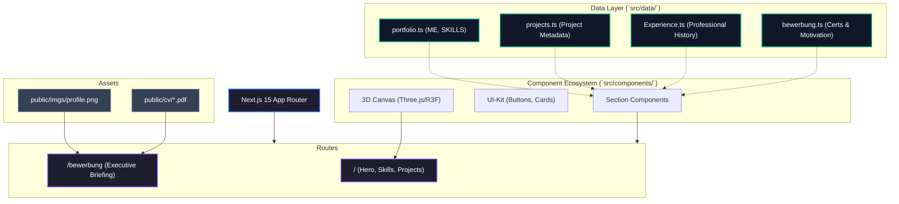

# Mallouli Portfolio - Full Project Documentation

## 🚀 Overview

This project is a high-end, elite developer portfolio and "Command Center" built for **Abdelhay Mallouli**. It serves as a technical showcase for German IT recruitment, specifically targeting an "Ausbildung zum Fachinformatiker".

The design follows a **"Midnight Pro"** aesthetic: dark navy backgrounds, electric blue accents, glassmorphism, and high-fidelity animations.

---

## 🏗️ Technical Architecture

The project follows a modern **S-D-C (Static-Data-Component)** architecture, ensuring that the UI remains decoupled from the content.



---

## 🛠️ Tech Stack

| Category         | Technology                               |
| :--------------- | :--------------------------------------- |
| **Framework**    | Next.js 15 (React 19)                    |
| **Styling**      | Tailwind CSS (Glassmorphism 2.0)         |
| **Animations**   | Framer Motion (Scroll-linked & Viewport) |
| **3D Rendering** | React Three Fiber / Three.js             |
| **Icons**        | Lucide React                             |
| **Type Safety**  | TypeScript (Strict Mode)                 |
| **Deployment**   | Vercel                                   |

---

## ✨ Core Features

### 1. The "Midnight Pro" UI

- **Glassmorphism:** High-performance backdrop filters on all cards.
- **Micro-interactions:** Smooth hover effects, glow states, and transition-transparency.
- **Global 3D Canvas:** A performant 3D environment rendered globally to provide depth.

### 2. Digital Bewerbungsmappe (`/bewerbung`)

An interactive application folder designed for the German market:

- **Candidate Identity:** Bento-grid profiling with direct German connections.
- **ROI Focus:** Project cards emphasize business value (e.g., "70% Time Saved").
- **Contextual Translation:** Moroccan diplomas are explained in German equivalent terms to assist HR.
- **Multilingual:** Seamless toggle between German (DE) and English (EN).

### 3. Engineering Culture

- **Scrum Focus:** Project descriptions include sprint roadmaps and methodologies.
- **Tech Prioritization:** Skills are clustered by "DevOps & Infrastructure" and "Backend Architecture".
- **Documentation:** Built-in Markdown documentation for system architecture.

---

## 📂 Directory Structure

```text
/
├── public/                 # Static assets (images, pdfs)
├── src/
│   ├── app/                # Routes and Layouts
│   │   ├── bewerbung/      # Application Folder Route
│   │   └── projects/       # Detailed Project Pages
│   ├── components/         # Reusable UI & 3D components
│   │   ├── 3d/             # Three.js / R3F logic
│   │   └── ui/             # Atomic UI elements
│   ├── data/               # The "Source of Truth" for all content
│   ├── lib/                # Utility functions (cn, etc.)
│   └── types/              # Global TypeScript interfaces
├── bewerbung_code.txt      # Reference code for recruiters
└── project_data.txt        # Full project data snapshot
```

---

## 📈 Performance & SEO

- **Image Optimization:** Uses specialized aspect ratios and object-fit for professional results.
- **Lazy Loading:** 3D components and heavy sections are viewport-triggered.
- **SEO Ready:** Proper heading hierarchy and semantic HTML for crawlability.
